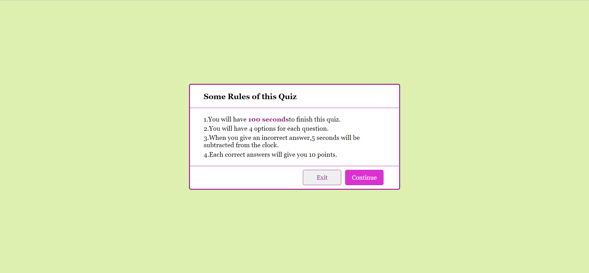
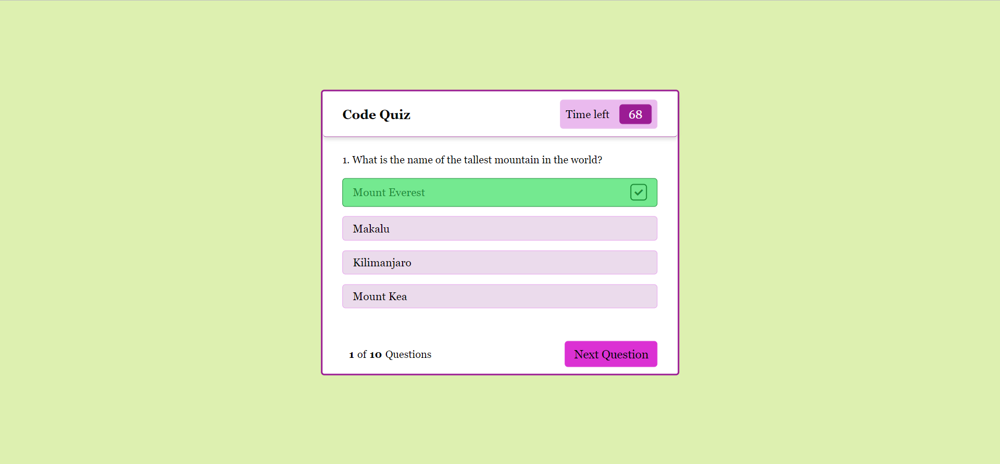
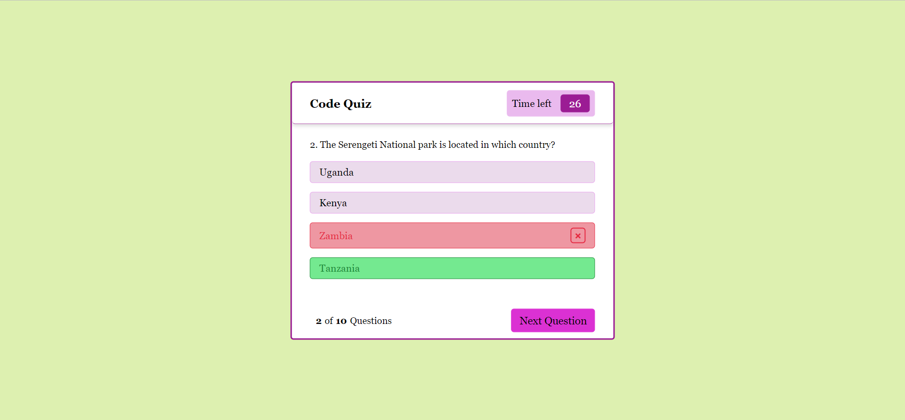
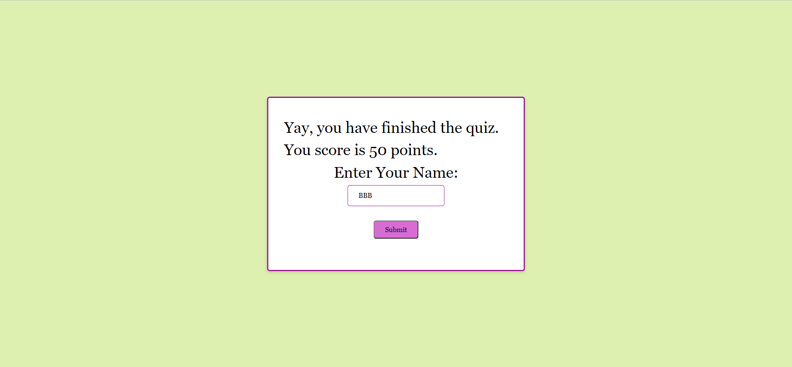

# HW-4-Code-Quiz

We have to create a timed quiz on Javascript fundamentals that stores high scores, has a timer,
validate the answers.

## Description

* This project was to create a quiz with all the fundamentals of HTML, CSS and Javascript.
  It uses object arrays, DOM methods, querySelectors, eventListeners, setting and getting values in local storage,
  craeting html tags and content on page dynamically, and also advanced CSS property of hiding and revealing different
  sections of the page.

## Expected Goal

* It is a simple page with start quiz button which will navigate to other info page.

* Then the questions with 4 options start. When a user select the answer, if the answer is correct, it turns green and if the answer is incorrect, it turns red and shows the correct answer too. Also next question button appears only after user has selected an answer.

* The timer starts with the quiz, when an incorrect answer is selected, 5 seconds will be deducted from the time left.

* Once the quiz is finished, user will enter his name and then highest scores will be shown next, his name will be in the list by order.

* User will be given the option to play again.

## Screenshots

